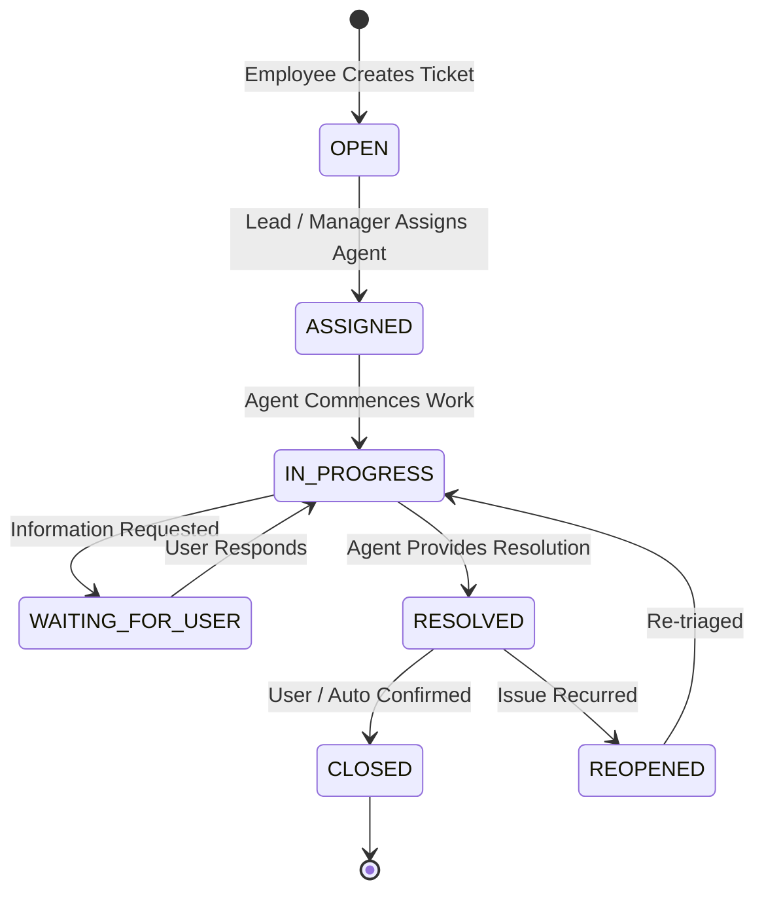

# ServiceDesk

[](https://github.com/Bariqa1/ServiceDesk/actions/workflows/ci.yml)
[](https://openjdk.org/projects/jdk/21/)
[](https://spring.io/projects/spring-boot)
[](https://angular.dev/)
[](https://www.postgresql.org/)
[](https://opensource.org/licenses/MIT)

> **Enterprise IT Service Management (ITSM) & Incident Lifecycle Platform**  
> Engineered with a high-performance **Java 21 / Spring Boot 3** Modular Monolith backend and an **Apple-Minimalist Angular 18** frontend featuring reactive bilingual support (Arabic RTL / English LTR).

---

## 🏛️ Engineering Vision & Architecture

ServiceDesk is designed to demonstrate mastery of mission-critical enterprise software engineering principles without unnecessary complexity:

* **Deterministic ITIL State Machine:** Explicit, validated state transitions with precondition checks, atomic transitions, and immutable audit logs.
* **Automated SLA Engine & Background Scheduler:** Priority-driven resolution and response targets calculated dynamically, continuously evaluated by a background scheduler, and escalated automatically.
* **Real-Time STOMP WebSocket Messaging:** Bidirectional event streaming broadcasting ticket creation, assignment, transition, and breach alerts without polling.
* **Fine-Grained Role-Based Access Control (RBAC):** Strict operational boundaries for Service Managers, Team Leads, Support Agents, and Business Employees.
* **Bilingual Apple Minimalist UI:** Ultra-clean design system supporting instantaneous switching between Arabic (RTL) and English (LTR), with Light and Dark modes.

---

## ⚙️ Key Architectural Capabilities

### 1. Interactive ITIL State Machine Stepper
Every ticket transitions strictly through verified lifecycle stages:

The frontend features a visual **Interactive State Stepper** that highlights the active stage, illustrates permitted transition paths, and enforces mandatory resolution summaries upon closing.

### 2. SLA Engine & Automated Escalation
* **Dynamic Target Calculation:** Automatically computes `responseDeadline` and `resolutionDeadline` based on category, service tier, and severity (Critical, High, Medium, Low).
* **Background Scheduler (`@Scheduled`):** Scans active tickets every 60 seconds, updates SLA elapsed percentages, transitions tickets from `WITHIN_SLA` to `AT_RISK` and `BREACHED`, and flags overdue incidents for automated manager escalation.
* **Real-Time Breach Alerts:** Broadcasts instantaneous SLA alerts to connected clients via WebSocket when incidents enter at-risk or breached thresholds.

### 3. Real-Time Synchronization via STOMP WebSockets
* **Message Broker:** Spring WebSocket STOMP endpoint (`/ws-servicedesk`) with subscription channel `/topic/tickets`.
* **Zero Polling Overhead:** Dashboard metrics, ticket queue positions, assignment updates, and comments refresh reactively upon WebSocket message receipt.

### 4. Apple Minimalist Design System
* **Bilingual Reactive Engine:** Reactive signals dynamically toggle text direction (`rtl` / `ltr`), typography (`IBM Plex Sans Arabic` and `SF Pro / Inter`), and dictionary lookups with zero page reloads.
* **Full-Width Queue & Compact Search Toolbar:** Replaced clunky multi-row filters with a single-row Apple-style toolbar (compact search, custom inline select dropdowns, and instant counters).
* **True Light & Dark Mode:** Curated Apple system tokens with soft gradients, subtle borders, and smooth transitions.

---

## 🛠️ Technology Stack

### Backend
* **Language:** Java 21 (LTS)
* **Framework:** Spring Boot 3.3.4
  * Spring Web (RESTful APIs)
  * Spring Security (JWT authentication HMAC-SHA384, BCrypt hashing)
  * Spring Data JPA & Hibernate 6 (Optimized pagination, auditing)
  * Spring WebSocket & STOMP (Real-time pub/sub messaging)
  * Spring Validation (Jakarta validation constraints)
* **Databases:** PostgreSQL 16 (Production) & H2 In-Memory (Test/Dev)
* **API Documentation:** SpringDoc OpenAPI 2.6 (Swagger UI)
* **Testing:** JUnit 5, Mockito, AssertJ, Spring Security Test, MockMvc

### Frontend
* **Framework:** Angular 18 (Standalone Components, Signals, Reactive Forms, Zoneless readiness)
* **Networking:** Angular `HttpClient`, `@stomp/stompjs` WebSocket client
* **Styling:** Custom Vanilla CSS Design System (Apple Light/Dark aesthetics, zero heavy CSS dependencies)
* **Internationalization:** Custom reactive `I18nService` (Arabic RTL & English LTR)

---

## 📁 Repository Structure

```
ServiceDesk/
├── .github/
│   └── workflows/
│       └── ci.yml               # GitHub Actions CI pipeline (Java 21 & Angular 18)
├── backend/
│   ├── src/main/java/com/servicedesk/
│   │   ├── common/              # Base entities, ApiResponse, GlobalExceptionHandler
│   │   ├── config/              # SecurityConfig, WebSocketConfig, DataInitializer
│   │   ├── dashboard/           # Dashboard metrics aggregator & REST endpoints
│   │   ├── masterdata/          # Categories, Services, Teams, SLA policies
│   │   ├── security/            # JWT provider, filter, UserPrincipal, UserDetails
│   │   ├── sla/                 # SlaCalculationService, SlaMonitoringService, Scheduler
│   │   ├── ticket/              # TicketController, TicketService, Entities, Enums, DTOs
│   │   ├── user/                # UserController, UserService, Role, User entities
│   │   └── websocket/           # TicketBroadcasterService, STOMP event DTOs
│   ├── src/test/java/           # Comprehensive JUnit 5 & Mockito test suite
│   └── pom.xml                  # Maven project descriptor (Java 21 compiler config)
├── frontend/
│   ├── src/
│   │   ├── app/
│   │   │   ├── core/            # AuthService, ApiService, WebSocketService, I18nService
│   │   │   ├── features/
│   │   │   │   ├── auth/        # Quick one-click Persona Login screen
│   │   │   │   ├── dashboard/   # Full-width KPI metrics & Live Recent Incidents
│   │   │   │   └── tickets/     # TicketList, TicketDetail, TicketCreate, StateStepper
│   │   │   └── shared/          # Navbar, Sidebar, ThemeService
│   │   └── styles.css           # Apple Minimalist design tokens & utility classes
│   ├── package.json
│   └── angular.json
├── docs/                        # Architecture decisions & requirements specifications
├── docker-compose.yml           # PostgreSQL container definition
└── README.md                    # Project documentation
```

---

## 🚀 Getting Started

### Prerequisites
* **Java:** JDK 21 LTS (`openjdk@21`)
* **Build Tool:** Apache Maven 3.9+
* **Node.js:** Node.js 20+ and npm 10+
* **Docker:** Docker Desktop (for containerized PostgreSQL)

---

### Step 1: Start PostgreSQL Database
```bash
docker-compose up -d
```
*(If running without Docker, the backend automatically falls back to an in-memory H2 database under the `test` profile).*

---

### Step 2: Start Backend Server
```bash
cd backend
export JAVA_HOME="/opt/homebrew/opt/openjdk@21"  # Or your JDK 21 path
mvn clean spring-boot:run
```
* Backend API will be available at: **`http://localhost:8081`**
* Interactive Swagger Docs: **`http://localhost:8081/swagger-ui/index.html`**
* STOMP WebSocket endpoint: **`ws://localhost:8081/ws-servicedesk`**

---

### Step 3: Start Frontend Client
```bash
cd frontend
npm install
npm start
```
* Open your browser at: **`http://localhost:4201`**

---

## 👥 Demo Personas & Pre-Seeded Accounts

The application includes an instant **One-Click Demo Switcher** on the login page:

| Persona | Username | Password | Role & Permissions |
|:---|:---|:---|:---|
| **Service Manager** | `manager` | `Manager@2026` | Full system governance, global SLA metrics, escalation oversight |
| **Team Lead** | `lead` | `Lead@2026` | Team dispatching, ticket assignment, queue management |
| **Support Agent** | `agent` | `Agent@2026` | Incident triage, state machine transitions, resolution & work logs |
| **Business Employee** | `employee` | `Emp@2026` | Self-service incident submission, personal request tracking |

---

## 🧪 Testing & CI/CD Pipeline

### Backend Unit & Integration Tests
```bash
cd backend
mvn clean test
```
The test suite validates:
* State Machine transition rules and forbidden paths (`TicketStateTransitionTest`)
* Dynamic SLA calculation and escalation formulas (`SlaEngineTest`)
* RBAC endpoint security rules (`UserRoleSecurityTest`)
* End-to-end incident lifecycle integration (`TicketControllerIntegrationTest`)

### Frontend Build & Typecheck
```bash
cd frontend
npm run build
```

### GitHub Actions CI
Every commit and pull request to `main` executes the automated CI pipeline:
1. **Backend Job:** Checks out code, sets up Temurin JDK 21, executes `mvn clean test`, and packages the JAR artifact.
2. **Frontend Job:** Sets up Node.js 20, installs dependencies with `npm ci`, and runs production `ng build`.

---

## 📄 License
This project is licensed under the [MIT License](LICENSE).
