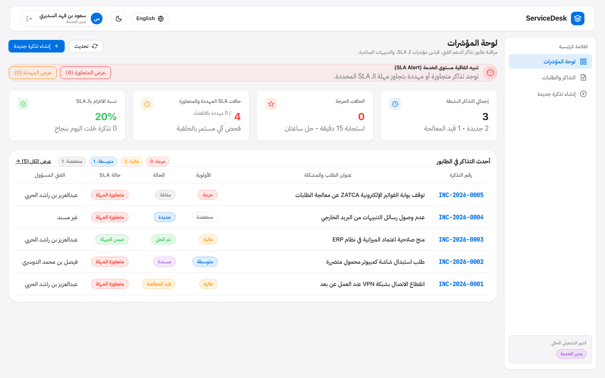
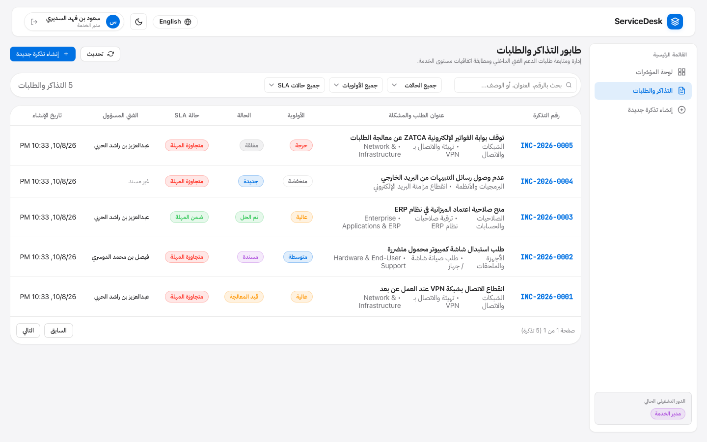
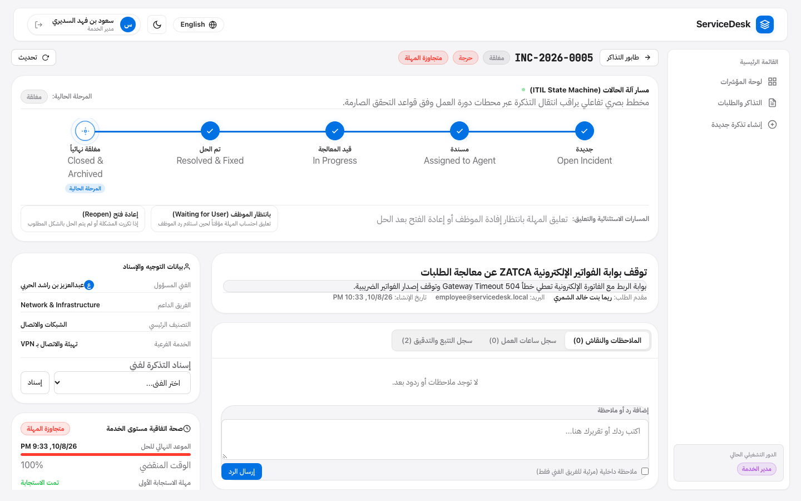
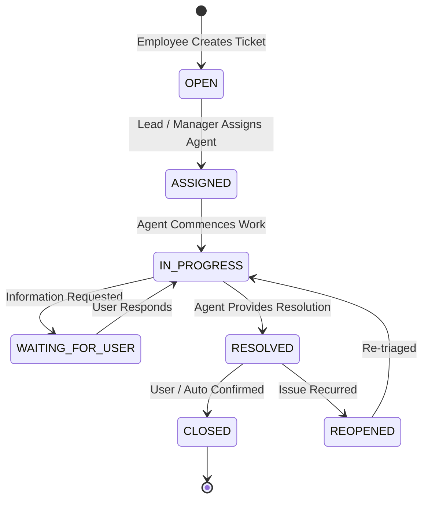

# ServiceDesk

[](https://github.com/Bariqa1/ServiceDesk/actions/workflows/ci.yml)
[](https://openjdk.org/projects/jdk/21/)
[](https://spring.io/projects/spring-boot)
[](https://angular.dev/)
[](https://www.postgresql.org/)
[](https://opensource.org/licenses/MIT)

ServiceDesk is an IT Service Management (ITSM) and incident lifecycle platform built with Java 21, Spring Boot 3, and Angular 18. The system enforces ITIL incident workflows, automated SLA tracking, background escalation, and real-time STOMP WebSocket synchronization.

---

## Screenshots

### Dashboard


### Incident Queue & Search


### Incident Details & ITIL State Machine Stepper


---

## Core Features

- **ITIL Incident Lifecycle Management:** Deterministic state machine governing transitions through `OPEN`, `ASSIGNED`, `IN_PROGRESS`, `WAITING_FOR_USER`, `RESOLVED`, `CLOSED`, and `REOPENED` with precondition checks and audit logging.
- **Interactive State Stepper:** Visual pipeline displaying active incident state, allowed transition paths, and resolution dialogs.
- **Automated SLA Engine:** Dynamic response and resolution deadlines computed per priority tier, monitored by a background scheduler evaluating breach thresholds.
- **Real-Time WebSocket Synchronization:** Spring STOMP messaging broker (`/ws-servicedesk`) broadcasting ticket lifecycle events and SLA alerts without client polling.
- **Role-Based Access Control (RBAC):** Permission boundaries for Service Managers, Team Leads, Support Agents, and Business Employees.
- **Internal Collaboration & Work Logs:** Threaded comments with private internal note toggles and agent time tracking.
- **Bilingual Interface:** Reactive localization supporting Arabic (RTL) and English (LTR).

---

## State Machine Architecture



---

## Technology Stack

### Backend
- **Language:** Java 21 LTS
- **Framework:** Spring Boot 3.3.4 (Spring Web, Spring Security, Spring Data JPA, Spring WebSocket)
- **Database:** PostgreSQL 16 (Production) / H2 In-Memory (Test profile)
- **Authentication:** JWT (HMAC-SHA384) + BCrypt Password Encoder
- **Messaging:** Spring STOMP WebSocket Broker (`/ws-servicedesk`)
- **Documentation:** SpringDoc OpenAPI 2.6 (Swagger UI)
- **Testing:** JUnit 5, Mockito, AssertJ, Spring Security Test, MockMvc

### Frontend
- **Framework:** Angular 18 (Standalone Components, Signals, Reactive Forms)
- **Networking:** Angular HttpClient, `@stomp/stompjs` WebSocket client
- **Styling:** Custom CSS Design System
- **Internationalization:** Custom reactive I18nService (Arabic RTL / English LTR)

---

## Project Structure

```
ServiceDesk/
├── .github/
│   └── workflows/
│       └── ci.yml               # GitHub Actions CI pipeline
├── backend/
│   ├── src/main/java/com/servicedesk/
│   │   ├── common/              # Base entities, ApiResponse, GlobalExceptionHandler
│   │   ├── config/              # SecurityConfig, WebSocketConfig, DataInitializer
│   │   ├── dashboard/           # Dashboard metrics controller & service
│   │   ├── masterdata/          # Categories, Services, Teams, SLA policies
│   │   ├── security/            # JWT provider, filter, UserPrincipal
│   │   ├── sla/                 # SlaCalculationService, SlaMonitoringService, Scheduler
│   │   ├── ticket/              # TicketController, TicketService, Entities, Enums, DTOs
│   │   ├── user/                # UserController, UserService, Role, User entities
│   │   └── websocket/           # TicketBroadcasterService, STOMP event DTOs
│   ├── src/test/java/           # JUnit 5 & Mockito test suite
│   └── pom.xml                  # Maven configuration
├── frontend/
│   ├── src/
│   │   ├── app/
│   │   │   ├── core/            # AuthService, ApiService, WebSocketService, I18nService
│   │   │   ├── features/        # Auth, Dashboard, Tickets (List, Detail, Create)
│   │   │   └── shared/          # Navbar, Sidebar, ThemeService
│   │   └── styles.css           # Design tokens and utilities
│   ├── package.json
│   └── angular.json
├── docs/
│   ├── screenshots/             # Interface screenshots
│   ├── api-specification.md
│   ├── architecture.md
│   └── requirements.md
├── docker-compose.yml           # PostgreSQL container setup
└── README.md
```

---

## Getting Started

### Prerequisites
- JDK 21 LTS
- Apache Maven 3.9+
- Node.js 20+ and npm 10+
- Docker & Docker Compose (Optional for PostgreSQL)

### 1. Database Setup
Using Docker Compose:
```bash
docker-compose up -d
```
*(When running without Docker, the backend automatically uses H2 in-memory database under the test profile).*

### 2. Backend Setup
```bash
cd backend
mvn clean spring-boot:run
```
- API Base URL: `http://localhost:8081`
- Swagger UI: `http://localhost:8081/swagger-ui/index.html`
- WebSocket STOMP Endpoint: `ws://localhost:8081/ws-servicedesk`

### 3. Frontend Setup
```bash
cd frontend
npm install
npm start
```
- Web Application: `http://localhost:4201`

---

## Pre-Configured Demo Credentials

| Role | Username | Password | Permissions |
|:---|:---|:---|:---|
| **Service Manager** | `manager` | `Manager@2026` | Full system administration, global SLA oversight |
| **Team Lead** | `lead` | `Lead@2026` | Team dispatching, ticket assignment, queue management |
| **Support Agent** | `agent` | `Agent@2026` | Incident triage, state transitions, resolution summaries, work logs |
| **Employee** | `employee` | `Emp@2026` | Self-service incident creation, ticket tracking |

---

## Testing & CI/CD

### Backend Tests
```bash
cd backend
mvn clean test
```

### Frontend Build
```bash
cd frontend
npm run build
```

### Continuous Integration
GitHub Actions automatically runs backend tests (`mvn clean test`) and frontend production build (`ng build`) on every push to `main`.

---

## License
MIT License.
