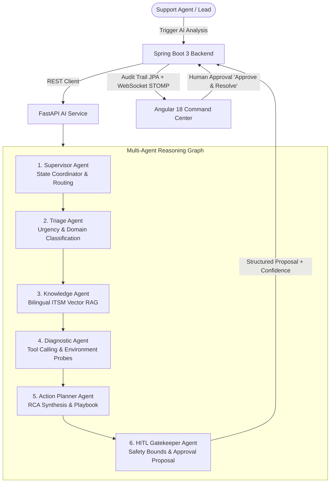

# ServiceDesk

[](https://github.com/Bariqa1/ServiceDesk/actions/workflows/ci.yml)
[](https://openjdk.org/projects/jdk/21/)
[](https://spring.io/projects/spring-boot)
[](https://fastapi.tiangolo.com/)
[](https://angular.dev/)
[]()
[](https://www.postgresql.org/)
[](https://opensource.org/licenses/MIT)

ServiceDesk is an Enterprise IT Service Management (ITSM) and Incident Lifecycle platform built with Java 21, Spring Boot 3, Angular 18, and a **Python FastAPI Autonomous Multi-Agent Intelligence Service**. The system pairs deterministic ITIL incident workflows with an Agentic AI reasoning pipeline featuring **Tool Calling, Knowledge Base RAG, and Human-in-the-Loop (HITL) safety governance**.

---

## Autonomous Multi-Agent AI Architecture

The system features a decoupled, production-grade **Autonomous Multi-Agent Service** (`ai-service`) operating as a multi-node directed state machine. When an agent requests diagnostic assistance on a ticket, the multi-agent graph coordinates specialized agents:



### Specialized Agent Graph Nodes:
1. **Supervisor Agent**: Initializes execution state, validates incident metadata, and coordinates agent transitions.
2. **Triage Agent**: Analyzes incident symptoms, categorizes technical domains (Database, Network, IAM, Server), and assesses business impact.
3. **Knowledge Agent (RAG)**: Retrieves relevant resolution patterns from a bilingual (Arabic & English) ITSM knowledge base using semantic token similarity.
4. **Diagnostic Agent (Tool Calling)**: Executes live diagnostic probes against simulated infrastructure environments (`ClusterPingTool`, `DirectoryLookupTool`, `SlaInspectorTool`) and captures observations.
5. **Action Planner Agent**: Synthesizes diagnostic findings and knowledge articles into a comprehensive **Root Cause Analysis (RCA)**, step-by-step remediation plan, and confidence score.
6. **HITL Gatekeeper Agent**: Enforces **Human-in-the-Loop safety boundaries**—prevents unverified automated changes on critical production services and packages solutions into an approval-gated proposal.

---

## Core Features

- **Autonomous Multi-Agent Command Center:** Real-time multi-agent reasoning trajectory visualization in Angular 18, showing each agent's thoughts, tools used, and observations.
- **Human-in-the-Loop (HITL) Governance:** Strict one-click approval gate allowing human support engineers to inspect agent RCA proposals and apply verified resolutions into ITIL workflows.
- **ITIL Incident Lifecycle Management:** Deterministic state machine governing transitions through `OPEN`, `ASSIGNED`, `IN_PROGRESS`, `WAITING_FOR_USER`, `RESOLVED`, `CLOSED`, and `REOPENED` with precondition checks and full audit logging.
- **Automated SLA Engine:** Dynamic response and resolution deadlines computed per priority tier, monitored by a background scheduler evaluating breach thresholds.
- **Real-Time WebSocket Synchronization:** Spring STOMP messaging broker (`/ws-servicedesk`) broadcasting ticket lifecycle events and SLA alerts without client polling.
- **Role-Based Access Control (RBAC):** Permission boundaries for Service Managers, Team Leads, Support Agents, and Business Employees.
- **Bilingual Interface:** Apple-inspired minimalist design system with reactive localization supporting Arabic (RTL) and English (LTR).

---

## Technology Stack

### Backend
- **Language:** Java 21 LTS
- **Framework:** Spring Boot 3.3.4 (Spring Web, Spring Security, Spring Data JPA, Spring WebSocket)
- **Database:** PostgreSQL 16 (Production) / H2 In-Memory (Test profile)
- **AI Integration:** Spring RestClient with automated fallback resilience, `AiAuditLog` JPA audit trail
- **Messaging:** Spring STOMP WebSocket Broker (`/ws-servicedesk`)
- **Documentation:** SpringDoc OpenAPI 2.6 (Swagger UI)

### AI Service
- **Language:** Python 3.11+
- **Framework:** FastAPI, Pydantic v2, Uvicorn
- **Architecture:** Directed Multi-Agent State Machine (LangGraph Pattern)
- **Capabilities:** Semantic Knowledge Base RAG (Arabic/English), Tool Calling & Execution Framework, Human-in-the-Loop Risk Verification

### Frontend
- **Framework:** Angular 18 (Standalone Components, Signals, Reactive Forms)
- **AI UI:** Interactive Agent Reasoning Trajectory Stepper, Live Confidence Metric Gauge, HITL Decision Panel
- **Networking:** Angular HttpClient, `@stomp/stompjs` WebSocket client
- **Styling:** Custom Apple-minimalist design system with fluid typography and dark mode support
- **Internationalization:** Custom reactive I18nService (Arabic RTL / English LTR)

---

## Project Structure

```
ServiceDesk/
├── ai-service/                  # Python FastAPI Multi-Agent Service
│   ├── app/
│   │   ├── agent_graph.py       # 6-node multi-agent state machine
│   │   ├── knowledge_base.py    # Bilingual ITSM RAG knowledge base
│   │   ├── models.py            # Pydantic schemas (Agent thoughts, tools, proposals)
│   │   ├── tools.py             # Diagnostic tool execution framework
│   │   └── main.py              # FastAPI endpoints (/api/v1/agent/diagnose)
│   ├── requirements.txt
│   └── Dockerfile
├── backend/                     # Spring Boot 3 Java 21 Service
│   ├── src/main/java/com/servicedesk/
│   │   ├── ai/                  # AI Controller, Service, Client, Audit Entity, DTOs
│   │   ├── common/              # Base entities, ApiResponse, GlobalExceptionHandler
│   │   ├── config/              # SecurityConfig, WebSocketConfig, DataInitializer
│   │   ├── dashboard/           # Dashboard metrics controller & service
│   │   ├── masterdata/          # Categories, Services, Teams, SLA policies
│   │   ├── security/            # JWT provider, filter, UserPrincipal
│   │   ├── sla/                 # SlaCalculationService, SlaMonitoringService, Scheduler
│   │   ├── ticket/              # TicketController, TicketService, Entities, Enums, DTOs
│   │   └── websocket/           # TicketBroadcasterService, STOMP event DTOs
│   └── pom.xml                  # Maven build configuration
├── frontend/                    # Angular 18 Single Page Application
│   ├── src/app/
│   │   ├── core/                # AuthService, ApiService, WebSocketService, I18nService
│   │   ├── features/
│   │   │   └── tickets/         # Ticket detail with AI Multi-Agent Command Center
│   │   └── shared/              # Navbar, Sidebar, ThemeService
│   └── package.json
├── docker-compose.yml           # Multi-container orchestration (PostgreSQL + AI + Backend)
└── README.md
```

---

## Getting Started

### Prerequisites
- JDK 21 LTS
- Apache Maven 3.9+
- Node.js 20+ and npm 10+
- Python 3.11+ (for running AI service locally without Docker)
- Docker & Docker Compose (Optional)

### Option A: Complete Stack with Docker Compose
```bash
docker-compose up --build -d
```
This boots PostgreSQL 16, the FastAPI AI service on port 8000, and backend dependencies.

### Option B: Local Development Setup

#### 1. AI Service Setup
```bash
cd ai-service
python3 -m venv venv
source venv/bin/activate
pip install -r requirements.txt
uvicorn app.main:app --host 0.0.0.0 --port 8000 --reload
```
- AI Service API: `http://localhost:8000`
- Interactive OpenAPI Docs: `http://localhost:8000/docs`

#### 2. Backend Setup
```bash
cd backend
mvn clean spring-boot:run
```
- API Base URL: `http://localhost:8081`
- Swagger UI: `http://localhost:8081/swagger-ui/index.html`
- WebSocket STOMP Endpoint: `ws://localhost:8081/ws-servicedesk`
*(Note: If the AI service is not running, the backend seamlessly activates its built-in resilient fallback agent).*

#### 3. Frontend Setup
```bash
cd frontend
npm install
npm start
```
- Web Application: `http://localhost:4201`

---

## Pre-Configured Demo Credentials

| Role | Username | Password | Permissions |
|:---|:---|:---|:---|
| **Service Manager** | `manager` | `Manager@2026` | Full system administration, global SLA oversight |
| **Team Lead** | `lead` | `Lead@2026` | Team dispatching, ticket assignment, queue management |
| **Support Agent** | `agent` | `Agent@2026` | Incident triage, AI agent diagnosis & HITL approval, state transitions |
| **Employee** | `employee` | `Emp@2026` | Self-service incident creation, ticket tracking |

---

## Testing & CI/CD

### Backend Tests
```bash
cd backend
mvn clean test
```

### Frontend Build
```bash
cd frontend
npm run build
```

### Continuous Integration
GitHub Actions automatically runs backend tests (`mvn clean test`) and frontend production build (`ng build`) on every push to `main`.

---

## License
MIT License.

